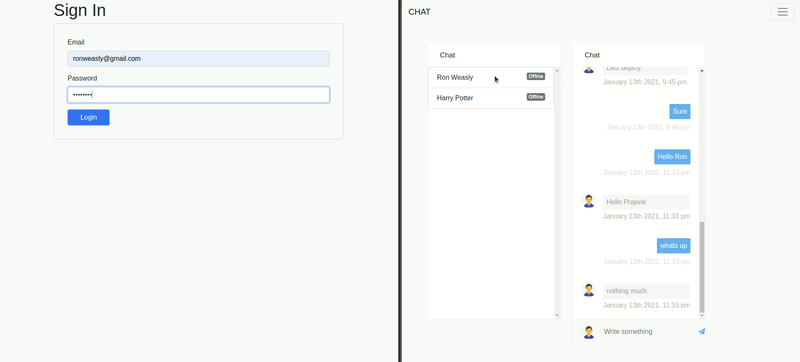

# Chat application with Socket IO

Realtime chat application powered by Node Js, React and Sockets.    
This is the frontend repository built with [React Js](https://reactjs.org/). 

## Related repositories

You can find the backend repository from this link: [Backend Repository](https://github.com/PJMessi/node-chat).  
You can find the frontend made in [Vue Js](https://vuejs.org/) from this link: [Frontend Repository with Vue Js](https://github.com/PJMessi/vue-todo). 

## Tech used

1. [Node Js](https://nodejs.org/en/) and [Express](https://expressjs.com/) at the backend.
2. [React Js](https://reactjs.org/) at the frontend.
3. [Socket IO](https://socket.io/) for realtime.
4. [Postgres](https://www.postgresql.org/) for database.

## Additional features
1. Welcome email for new user.

## Chat demo

## User status demo

## Guide

1. Clone the repository.
2. Install the dependencies:  
    `npm install`
3. Run the server:  
    `npm start`

<!-- ## Learn More

You can learn more in the [Create React App documentation](https://facebook.github.io/create-react-app/docs/getting-started).

To learn React, check out the [React documentation](https://reactjs.org/). -->
